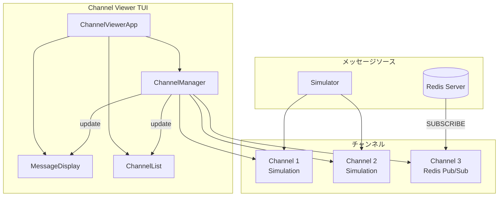

# Channel Viewer

TUIベースのチャンネルメッセージビューアーです。複数のチャンネルからのメッセージをリアルタイムで表示し、チャンネル間を切り替えて監視できます。

## 概要

Channel Viewerは、[Textual](https://textual.textualize.io/)フレームワークを使用したターミナルユーザーインターフェース（TUI）アプリケーションです。

### 主な機能

- 複数チャンネルの同時監視
- チャンネル間の切り替え表示
- リアルタイムメッセージ受信
- 接続状態の可視化
- **Redis Pub/Sub購読機能**

### 現在の実装状況

| 機能 | 状態 | 説明 |
|------|------|------|
| TUI基盤 | ✅ 完了 | Textualベースのチャンネル/メッセージ表示 |
| シミュレーション | ✅ 完了 | ダミーメッセージによるデモ動作 |
| Redis Pub/Sub連携 | ✅ 完了 | 実際のRedisチャンネル購読機能 |
| Summonerモニタリング | ✅ 利用可能 | summoner:*:monitor チャンネルの購読 |

## 起動方法

### 前提条件

- Python 3.10以上
- 必要なパッケージがインストール済み

### インストール

```bash
cd scripts/channel_viewer
pip install -r requirements.txt
```

### 起動

```bash
# channel_viewerディレクトリから
python main.py

# または、リポジトリルートから
python scripts/channel_viewer/main.py
```

## キーバインド

| キー | 動作 |
|------|------|
| `n` | 新しいシミュレーションチャンネルを作成 |
| `r` | Redisチャンネル作成ダイアログを開く |
| `d` | 選択中のチャンネルを削除 |
| `f` | 表示を更新 |
| `q` | アプリケーション終了 |
| `↑` / `↓` | チャンネル選択 |

## 画面構成

```
┌─────────────────────────────────────────────────────────────┐
│                      Channel Viewer                          │
├─────────────────┬───────────────────────────────────────────┤
│ 📡 Channels     │ 💬 Messages                                │
│                 │                                            │
│ 🟢 General (5)  │ [12:00:00] System: Welcome to General     │
│ 🟢 Random (3)   │ [12:00:15] User: Hello everyone           │
│ 🟢 Alerts (1)   │ [12:00:30] Bot: Task completed            │
│                 │                                            │
├─────────────────┴───────────────────────────────────────────┤
│ Channels: 3/3 connected | Total Messages: 9                  │
├─────────────────────────────────────────────────────────────┤
│ [n] New  [d] Delete  [r] Refresh  [q] Quit                  │
└─────────────────────────────────────────────────────────────┘
```

### チャンネル状態アイコン

| アイコン | 状態 |
|---------|------|
| 🟢 | 接続中（Connected） |
| 🟡 | 接続中（Connecting） |
| ⚫ | 切断（Disconnected） |
| 🔴 | エラー（Error） |

### チャンネルタイプアイコン

| アイコン | タイプ |
|---------|------|
| 💬 | シミュレーションチャンネル |
| 📡 | Redis Pub/Subチャンネル |

## ファイル構成

```
channel_viewer/
├── main.py           # エントリーポイント
├── tui.py            # TUIコンポーネント（Textualアプリ）
├── channel.py        # チャンネル管理クラス
├── message.py        # メッセージデータ構造
├── simulator.py      # シミュレーション用メッセージ生成
├── redis_channel.py  # Redis Pub/Sub購読機能
├── requirements.txt  # 依存パッケージ
└── README.md         # このファイル
```

## Redis Pub/Sub購読

### TUIでの使用方法

1. アプリケーションを起動: `python main.py`
2. `r`キーを押してRedisチャンネル作成ダイアログを開く
3. 購読したいチャンネル名を入力（例: `summoner:abc123:monitor`）
4. Host/Portを確認（Docker環境では`redis:6379`）
5. Enterまたは"Create"ボタンで作成

### Summonerオーケストレーションとの連携

Summonerオーケストレーションでは、`orchestration-init --summoner-mode` が `monitor_channel` を生成します。

```bash
# 1. オーケストレーション初期化
python skills/orchestration-init/scripts/init_orchestration.py \
  --summoner-mode --max-children 3 --json > /tmp/config.json

# 2. monitor_channelを取得
MONITOR_CHANNEL=$(jq -r .monitor_channel /tmp/config.json)
echo "Monitor channel: ${MONITOR_CHANNEL}"
# 出力例: summoner:a1b2c3d4-...:monitor

# 3. channel_viewerでモニタリング
python scripts/channel_viewer/main.py
# TUI内で r を押して ${MONITOR_CHANNEL} を購読
```

### メッセージを送信（別ターミナル）

```bash
python skills/redis-rpush-sender/scripts/rpush.py \
  --channel summoner:abc123:monitor \
  summoner:abc123:tasks:1 \
  '{"type":"task","content":"Hello"}'
```

### メッセージ形式

Pub/Subで受信するJSONメッセージ：

```json
{
  "queue": "summoner:abc123:tasks:1",
  "message": "{\"type\":\"task\",\"content\":...}",
  "timestamp": "2025-01-29T12:00:00+00:00"
}
```

TUIでの表示：

```
[12:00:00] redis: [task] summoner:abc123:tasks:1: content_preview
```

## アーキテクチャ



## 開発者向け情報

### 依存パッケージ

- `textual>=0.40.0` - TUIフレームワーク

### Redis Pub/Sub実装について

- `redis_channel.py`でRESPプロトコルを直接使用（外部ライブラリ不要）
- 各チャンネルごとにバックグラウンドスレッドでSUBSCRIBE
- 受信メッセージを`Channel.add_message()`で追加

## 関連ドキュメント

- [orchestration-init/SKILL.md](../../skills/orchestration-init/SKILL.md) - Summonerモードと`monitor_channel`の詳細
- [redis-rpush-sender/SKILL.md](../../skills/redis-rpush-sender/SKILL.md) - `--channel`オプションによるPub/Sub通知
- [summoner.agent.md](../../agents/summoner.agent.md) - Summonerオーケストレーションの全体像
