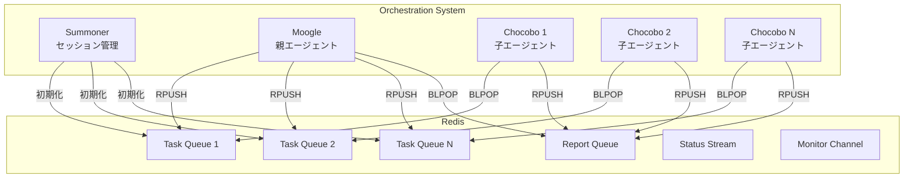

# Redis Orchestration App

Redis Blocked List/ストリームを使用したエージェント間通信・オーケストレーションライブラリです。

## 概要

このアプリケーションは、親エージェント（moogle/summoner）と子エージェント（chocobo）間のメッセージング基盤を提供します。Redis の Blocked List（RPUSH/BLPOP）を使用した非同期メッセージキューシステムを実装しています。

### 主な機能

- **オーケストレーション初期化**: 親子エージェント間の通信チャネルを自動セットアップ
- **メッセージ送信（RPUSH）**: タスク、レポート、シャットダウンメッセージの送信
- **メッセージ受信（BLPOP）**: ブロッキング方式でのメッセージ待機・受信
- **2つの動作モード**: 通常モードとSummonerモード

## ディレクトリ構成

```
app/
├── __init__.py           # パッケージ初期化・公開API定義
├── config.py             # Redis接続設定、オーケストレーション設定
├── redis_client.py       # Redisクライアント（RESP直接/redis-py）
├── messages.py           # メッセージフォーマット定義
├── orchestration.py      # オーケストレーション初期化・管理
├── sender.py             # RPUSH送信モジュール
├── receiver.py           # BLPOP受信モジュール
├── utils.py              # ユーティリティ関数
├── cli/                  # CLIツール
│   ├── rpush.py          # RPUSH CLIコマンド
│   ├── blpop.py          # BLPOP CLIコマンド
│   └── init_orch.py      # オーケストレーション初期化CLI
├── scenarios/            # シナリオスクリプト
│   ├── summoner_scenario.py   # Summonerシナリオ
│   ├── moogle_scenario.py     # Moogleシナリオ
│   └── chocobo_scenario.py    # Chocoboシナリオ
└── tests/                # テストスイート
    ├── conftest.py       # pytest fixtures
    ├── test_config.py
    ├── test_messages.py
    ├── test_orchestration.py
    ├── test_sender.py
    ├── test_receiver.py
    ├── test_redis_client.py
    └── test_scenario.py
```

## アーキテクチャ



## 主要コンポーネント

### 設定モジュール (`config.py`)

#### RedisConfig

Redis接続設定を管理するデータクラス。

```python
from app.config import RedisConfig, get_default_config

# デフォルト設定を取得（環境変数から読み込み）
config = get_default_config()

# カスタム設定
config = RedisConfig(
    host="redis",
    port=6379,
    db=0,
    password=None,
    socket_timeout=10.0,
    default_ttl=3600,
)
```

#### 環境変数

| 環境変数 | デフォルト値 | 説明 |
|----------|-------------|------|
| `REDIS_HOST` | `redis` | Redisホスト名 |
| `REDIS_PORT` | `6379` | Redisポート番号 |
| `REDIS_DB` | `0` | データベース番号 |
| `REDIS_PASSWORD` | なし | 認証パスワード |
| `REDIS_TIMEOUT` | `10` | タイムアウト秒数 |
| `REDIS_TTL` | `3600` | デフォルトTTL秒数 |

### Redisクライアント (`redis_client.py`)

2種類のクライアント実装を提供：

1. **RespRedisClient**: RESPプロトコル直接実装（外部依存なし）
2. **RedisClient**: redis-pyライブラリ使用（BLPOPなどのブロッキング操作対応）

```python
from app.redis_client import create_client, RedisClient, RespRedisClient

# 自動選択（redis-pyがあればそちらを使用）
client = create_client()

# 明示的に選択
resp_client = RespRedisClient(host="redis", port=6379)
redis_client = RedisClient(host="redis", port=6379)
```

### メッセージ (`messages.py`)

エージェント間で使用するメッセージ形式を定義：

| メッセージタイプ | 説明 | 用途 |
|-----------------|------|------|
| `TaskMessage` | タスク指示 | 親→子へのタスク配信 |
| `ReportMessage` | 結果報告 | 子→親への処理結果 |
| `ShutdownMessage` | 終了指示 | エージェントの終了通知 |
| `StatusMessage` | 状態通知 | エージェントの状態変更 |

```python
from app.messages import TaskMessage, ReportMessage, parse_message

# タスクメッセージ作成
task = TaskMessage.create(
    prompt="データを処理してください",
    session_id="abc123",
    child_id=1,
    context={"key": "value"},
    priority=1,
)

# JSON変換
json_str = task.to_json()

# パース（自動タイプ判別）
parsed = parse_message(json_str)
```

### オーケストレーション (`orchestration.py`)

#### 通常モード

```python
from app.orchestration import initialize_orchestration, get_config, cleanup_session

# 初期化
config = initialize_orchestration(
    host="redis",
    port=6379,
    prefix="myproject-hostname",  # 省略時は自動生成
    max_children=9,
    ttl=3600,
)

# 設定取得
config = get_config(host="redis", port=6379, prefix="myproject-hostname-001")

# クリーンアップ
cleanup_session(host="redis", port=6379, config=config)
```

#### Summonerモード

```python
from app.orchestration import initialize_summoner_orchestration

config = initialize_summoner_orchestration(
    host="redis",
    port=6379,
    max_children=5,
    session_id=None,  # 省略時はUUID自動生成
    ttl=3600,
)
```

### 送信モジュール (`sender.py`)

```python
from app.sender import RedisSender, send_message, send_with_publish

# クラスを使用
sender = RedisSender(host="redis", port=6379)
result = sender.send_message("my-queue", '{"type": "task", ...}')

# 便利関数を使用
result = send_message("my-queue", "Hello, World!")

# RPUSH + Pub/Sub同時送信
result = send_with_publish("my-queue", message, "monitor-channel")
```

### 受信モジュール (`receiver.py`)

```python
from app.receiver import (
    MessageReceiver,
    receive_message,
    receive_task,
    receive_report,
)

# クラスを使用
receiver = MessageReceiver(host="redis", port=6379)
received = receiver.receive("my-queue", timeout=10)

# 便利関数を使用
msg = receive_message("my-queue", timeout=5)
task = receive_task("task-queue", timeout=0)  # 無限待機
report = receive_report("report-queue", timeout=30)

# イテレータで連続受信
for msg in receiver.receive_iter("my-queue", timeout=5):
    print(msg.raw_data)
```

## CLIツール

### RPUSH送信 (`rpush`)

```bash
# 単一メッセージ送信
python -m app.cli.rpush my-queue "Hello, World!"

# 複数メッセージ送信
python -m app.cli.rpush my-queue "msg1" "msg2" "msg3"

# 標準入力から読み込み
echo -e "msg1\nmsg2" | python -m app.cli.rpush --stdin my-queue

# Pub/Sub同時送信
python -m app.cli.rpush --channel monitor-channel my-queue '{"type":"task"}'

# カスタムホスト指定
python -m app.cli.rpush --host localhost --port 6379 my-queue "message"
```

### BLPOP受信 (`blpop`)

```bash
# 単一メッセージ受信
python -m app.cli.blpop my-queue

# タイムアウト指定（10秒）
python -m app.cli.blpop my-queue --timeout 10

# 複数メッセージ受信
python -m app.cli.blpop my-queue --count 5

# メッセージをパースして表示
python -m app.cli.blpop my-queue --parse

# 連続受信モード（Ctrl+C で停止）
python -m app.cli.blpop my-queue --continuous --timeout 5
```

### オーケストレーション初期化 (`init_orch`)

```bash
# 通常モードで初期化
python -m app.cli.init_orch

# カスタム設定
python -m app.cli.init_orch --max-children 5 --prefix "myproject"

# Summonerモードで初期化
python -m app.cli.init_orch --summoner-mode --max-children 3

# JSON形式で出力
python -m app.cli.init_orch --summoner-mode --json

# 既存設定を取得
python -m app.cli.init_orch get --session-id abc123

# セッションをクリーンアップ
python -m app.cli.init_orch cleanup --session-id abc123
```

## シナリオスクリプト

エージェントの動作をシミュレートするスクリプト群：

### Summonerシナリオ

```bash
python -m app.scenarios.summoner_scenario --max-children 5

# JSON出力
python -m app.scenarios.summoner_scenario --json
```

### Moogleシナリオ

```bash
python -m app.scenarios.moogle_scenario --session-id SESSION_ID

# タスクを指定
python -m app.scenarios.moogle_scenario --session-id SESSION_ID \
    --tasks "Task 1" "Task 2" "Task 3"
```

### Chocoboシナリオ

```bash
python -m app.scenarios.chocobo_scenario \
    --session-id SESSION_ID \
    --child-id 1 \
    --max-tasks 10
```

## インストール

### 依存関係

- Python 3.10+
- redis-py（オプション、BLPOPを使用する場合は必須）

```bash
# redis-pyをインストール
pip install redis

# または、仮想環境を使用
python -m venv .venv
source .venv/bin/activate
pip install redis
```

### Docker環境

`compose.yml` を使用してRedisサーバーを起動：

```bash
docker compose up -d
```

これにより、以下のRedis環境が利用可能になります：
- ホスト: `redis`（Docker内部）または `localhost`（ホストから）
- ポート: `6379`
- ネットワーク: `dev-network`

## テストの実行

```bash
# 全テストを実行
pytest app/tests/

# 特定のテストファイルを実行
pytest app/tests/test_messages.py

# 詳細出力
pytest app/tests/ -v

# カバレッジ付き
pytest app/tests/ --cov=app --cov-report=html
```

### テスト環境の注意点

- テストにはRedisサーバーが必要です
- Redisに接続できない場合、一部のテストは自動的にスキップされます
- 環境変数 `REDIS_HOST` でRedisホストを指定可能

## 動作モードの比較

| 特徴 | 通常モード | Summonerモード |
|------|-----------|----------------|
| セッションID | タイムスタンプ+PID | UUID |
| プレフィックス | `{project}-{host}-{seq}` | `summoner:{uuid}` |
| 親→子キュー | 子ごとに個別 | 子ごとに個別 |
| 子→親キュー | 子ごとに個別 | **全員共有** |
| モニターチャンネル | なし | あり |
| 用途 | 汎用 | 並列タスク処理 |

## ライセンス

このプロジェクトはMITライセンスの下で公開されています。
