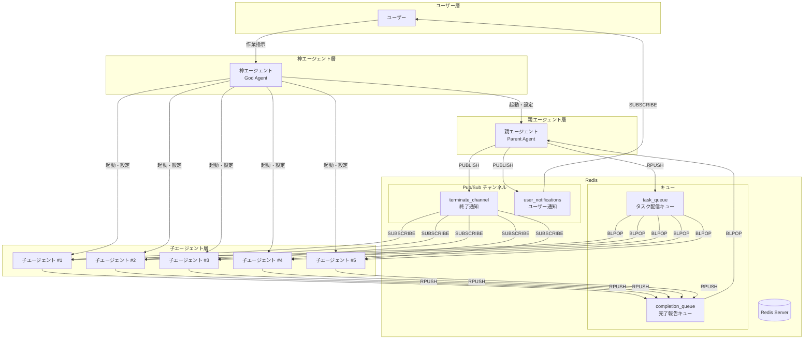
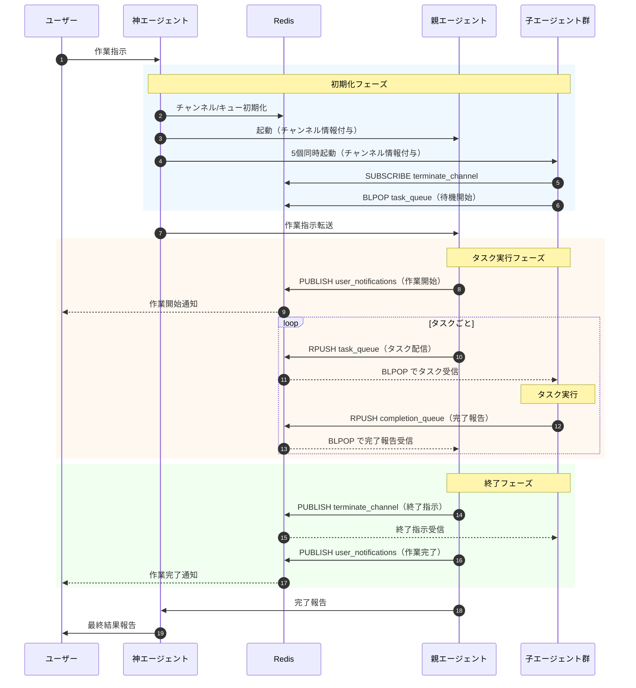

# Multi-Agent System

Redis を介した神エージェント・親エージェント・子エージェント（5個）による分散タスク処理システムです。

## 概要

このスキルは、複雑なタスクを複数のエージェントに分散して並列処理するためのマルチエージェントシステムを提供します。

### 特徴

- **スケーラブル**: 5個の子エージェントによる並列タスク処理
- **疎結合**: Redis を介した非同期メッセージング
- **リアルタイム通知**: Pub/Sub によるユーザーへの進捗通知
- **セッション分離**: 複数セッションの並行実行が可能

## アーキテクチャ



## Quick Start

### 前提条件

- Python 3.10+
- Redis サーバー（Docker 推奨）

### 1. Redis サーバーを起動

```bash
docker run -d --name redis -p 6379:6379 redis:alpine
```

### 2. 神エージェントを実行

```bash
cd /workspaces/devcontainer/skills/multi-agent-system
python god_agent.py --task "コードレビューを実行してください"
```

神エージェントが自動的に親エージェントと5個の子エージェントを起動し、タスクを分散処理します。

## 使用方法

### 基本的な使い方

```bash
# 基本実行
python god_agent.py --task "作業指示をここに記述"

# 詳細ログ付き
python god_agent.py --task "テストを実行" --verbose

# カスタム Redis 接続
python god_agent.py --task "ビルドを実行" --redis-host redis.local --redis-port 6380
```

### 処理フロー



## CLI オプション

### 神エージェント (`god_agent.py`)

| オプション | 短縮形 | 必須 | デフォルト | 説明 |
|-----------|--------|------|-----------|------|
| `--task` | | ✓ | - | ユーザーからの作業指示 |
| `--redis-host` | | | `localhost` / `$REDIS_HOST` | Redis サーバーホスト |
| `--redis-port` | | | `6379` / `$REDIS_PORT` | Redis サーバーポート |
| `--working-dir` | | | カレントディレクトリ | 作業ディレクトリパス |
| `--docs-root` | | | `$DOCS_ROOT` | ドキュメント出力ルート |
| `--verbose` | `-v` | | | 詳細ログを出力 |

### 親エージェント (`parent_agent.py`)

| オプション | 短縮形 | 必須 | デフォルト | 説明 |
|-----------|--------|------|-----------|------|
| `--session-id` | `-s` | ✓ | - | セッションID |
| `--agent-id` | `-a` | ✓ | - | エージェントID |
| `--task` | `-t` | ✓ | - | 作業指示 |
| `--redis-host` | | | `redis` | Redis サーバーホスト |
| `--redis-port` | | | `6379` | Redis サーバーポート |
| `--timeout` | | | `300` | タスクタイムアウト秒数 |
| `--completion-timeout` | | | `0` | 全体完了待機タイムアウト（0=無限） |
| `--json` | | | | 結果をJSON形式で出力 |
| `--debug` | | | | デバッグログを有効化 |

### 子エージェント (`child_agent.py`)

| オプション | 必須 | デフォルト | 説明 |
|-----------|------|-----------|------|
| `--session-id` | ✓ | - | セッションID |
| `--agent-id` | ✓ | - | エージェントID（`child-1` 〜 `child-5`） |
| `--redis-host` | | `localhost` | Redis サーバーホスト |
| `--redis-port` | | `6379` | Redis サーバーポート |
| `--blpop-timeout` | | `5` | BLPOP タイムアウト秒数 |
| `--log-level` | | `INFO` | ログレベル（DEBUG/INFO/WARN/ERROR） |

## Redis チャンネル仕様

### 命名規則

```
{システム名}:{リソースタイプ}:{用途}:{セッションID}
```

| 要素 | 説明 | 例 |
|------|------|-----|
| システム名 | アプリケーション識別子 | `mas` (Multi-Agent System) |
| リソースタイプ | `queue` / `channel` | `queue`, `channel` |
| 用途 | 機能を表す名前 | `task`, `completion`, `terminate`, `notify` |
| セッションID | セッション識別子 | `20260129-101213-a1b2c3d4` |

### キュー（List 構造）

| キュー名 | 方向 | 操作 | 用途 |
|---------|------|------|------|
| `mas:queue:task:{session_id}` | 親 → 子 | 親: `RPUSH` / 子: `BLPOP` | タスク配信 |
| `mas:queue:completion:{session_id}` | 子 → 親 | 子: `RPUSH` / 親: `BLPOP` | 完了報告 |

### Pub/Sub チャンネル

| チャンネル名 | 方向 | 操作 | 用途 |
|-------------|------|------|------|
| `mas:channel:terminate:{session_id}` | 親 → 子 | 親: `PUBLISH` / 子: `SUBSCRIBE` | 終了通知 |
| `mas:channel:notify:{session_id}` | 全 → ユーザー | エージェント: `PUBLISH` / ユーザー: `SUBSCRIBE` | ユーザー通知 |

### メッセージタイプ

| タイプ | 方向 | 説明 |
|--------|------|------|
| `STARTUP_INFO` | 神 → 親/子 | 起動情報メッセージ |
| `TASK_DISPATCH` | 親 → 子 | タスク配信メッセージ |
| `TASK_COMPLETION` | 子 → 親 | 完了報告メッセージ |
| `USER_NOTIFICATION` | 全 → ユーザー | ユーザー通知メッセージ |
| `SHUTDOWN_COMMAND` | 親 → 子 | 終了指示メッセージ |

### 通知イベント

| イベント | 発行者 | 説明 |
|----------|--------|------|
| `WORK_STARTED` | 親 | 作業全体の開始 |
| `WORK_COMPLETED` | 親 | 作業全体の完了 |
| `TASK_STARTED` | 子 | 個別タスクの開始 |
| `TASK_COMPLETED` | 子 | 個別タスクの完了 |
| `TASK_FAILED` | 子 | 個別タスクの失敗 |
| `AGENT_READY` | 子 | エージェント待機開始 |
| `AGENT_TERMINATED` | 子 | エージェント終了 |

## ファイル構成

```
skills/multi-agent-system/
├── god_agent.py       # 神エージェント（オーケストレーター）
├── parent_agent.py    # 親エージェント（タスク配信・完了管理）
├── child_agent.py     # 子エージェント（タスク実行）
├── lib/               # 共通ライブラリ
│   ├── __init__.py    # パッケージエクスポート
│   ├── redis_client.py # Redis 操作ラッパー
│   ├── message.py     # メッセージ生成・解析
│   ├── channel_config.py # チャンネル設定
│   └── logger.py      # 構造化ロギング
├── SKILL.md           # このドキュメント
└── README.md          # 詳細技術ドキュメント（オプション）
```

## エラーハンドリング

### タスク失敗時

- 子エージェントはエラー詳細を含む完了報告を送信
- 親エージェントがリトライ判断を実施
- ユーザーに失敗通知を配信

### エージェント無応答時

- タイムアウト検出後、タスクを別の子エージェントに再配信
- 神エージェントが無応答エージェントを監視・再起動

## プロトコルバージョン

```
Version: 1.0.0
```
