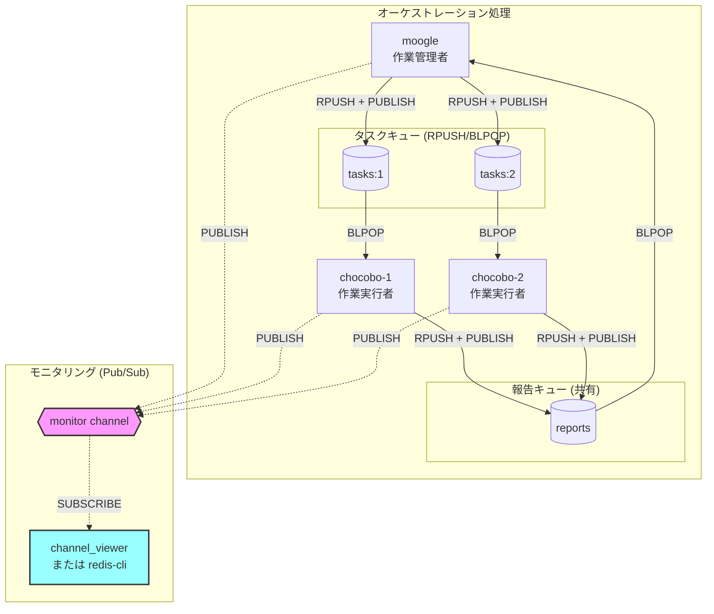
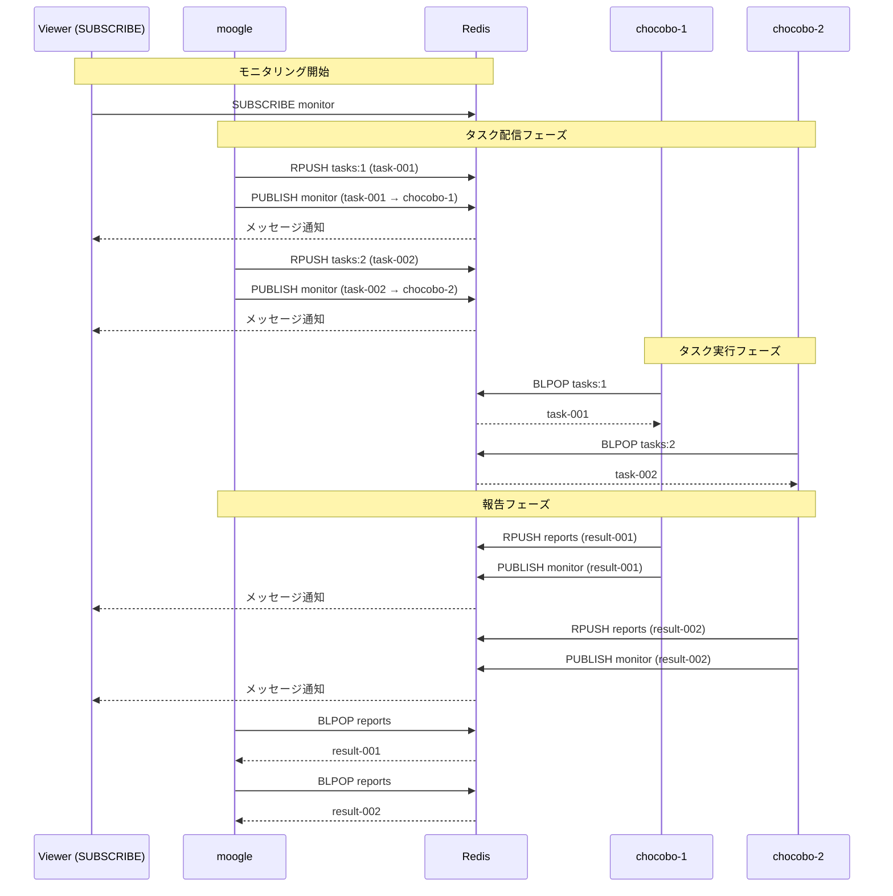

# Orchestration Init

エージェントオーケストレーション用のRedisリスト/ストリームを初期化する。

## 動作モード

### 通常モード（デフォルト）

従来のBlocked List方式で、親子間で個別のキューを使用：

| 方向 | 送信側操作 | 受信側操作 | 説明 |
|------|-----------|-----------|------|
| 親→子 | `RPUSH {prefix}:p2c:{N}` | `BLPOP {prefix}:p2c:{N}` | タスク割り当て |
| 子→親 | `RPUSH {prefix}:c2p:{N}` | `BLPOP {prefix}:c2p:{N}` | 結果報告 |

### Summonerモード（`--summoner-mode`）

Summoner/Chocoboパターン用の簡略化されたキュー構造：

| 方向 | 送信側操作 | 受信側操作 | 説明 |
|------|-----------|-----------|------|
| 親→子 | `RPUSH summoner:{uuid}:tasks:{N}` | `BLPOP summoner:{uuid}:tasks:{N}` | タスク割り当て（chocobo毎に個別） |
| 子→親 | `RPUSH summoner:{uuid}:reports` | `BLPOP summoner:{uuid}:reports` | 結果報告（**全chocobo共有**） |
| 監視 | `PUBLISH summoner:{uuid}:monitor` | `SUBSCRIBE summoner:{uuid}:monitor` | モニタリング用Pub/Sub |

**Summonerモードの特徴:**
- セッションIDがUUID形式（例: `a1b2c3d4-e5f6-7890-abcd-ef1234567890`）
- 報告キューが全chocoboで共有（親が単一キューを監視すればOK）
- モニタリング用Pub/Subチャンネル付き

## 前提条件

- Redisが起動済み（compose.ymlで `redis` サービスが定義されていること）
- Python 3.x がインストール済み

## Quick Start

```bash
# 通常モード: デフォルト設定で初期化（最大9子、自動プレフィックス）
python scripts/init_orchestration.py

# 通常モード: JSON形式で出力
python scripts/init_orchestration.py --json

# Summonerモード: 3つのchocoboで初期化
python scripts/init_orchestration.py --summoner-mode --max-children 3 --json
```

## 命名規則

### 通常モード

```
{PROJECT_NAME}-{HOST_NAME}-{連番}:{リソースタイプ}:{番号}
```

例: `devcontainer-4c606c3024b0-001:p2c:1`

| 要素 | 説明 | 例 |
|------|------|-----|
| PROJECT_NAME | 環境変数 `$PROJECT_NAME` | `devcontainer` |
| HOST_NAME | 環境変数 `$HOSTNAME`（12文字まで） | `4c606c3024b0` |
| 連番 | 重複回避用の3桁連番（自動検索） | `001`, `002` |

### Summonerモード

```
summoner:{UUID}:{リソースタイプ}[:{番号}]
```

例: `summoner:a1b2c3d4-e5f6-7890-abcd-ef1234567890:tasks:1`

| 要素 | 説明 | 例 |
|------|------|-----|
| summoner | 固定プレフィックス | `summoner` |
| UUID | 自動生成されるUUID | `a1b2c3d4-e5f6-7890-abcd-ef1234567890` |

## 初期化されるリソース

### 通常モード

| リソース | 用途 | 名前パターン | 操作 |
|---------|------|-------------|------|
| 親→子リスト | タスク割り当て | `{prefix}:p2c:{1-9}` | RPUSH/BLPOP |
| 子→親リスト | 結果報告 | `{prefix}:c2p:{1-9}` | RPUSH/BLPOP |
| 状態ストリーム | イベント記録 | `{prefix}:status` | XADD/XREAD |
| 結果ストリーム | 結果集約 | `{prefix}:results` | XADD/XREAD |
| 制御リスト | 停止/キャンセル | `{prefix}:control` | RPUSH/BLPOP |
| 設定キー | セッション情報 | `{prefix}:config` | GET/SET |

### Summonerモード

| リソース | 用途 | 名前パターン | 操作 |
|---------|------|-------------|------|
| タスクリスト | タスク割り当て | `summoner:{uuid}:tasks:{1-N}` | RPUSH/BLPOP |
| 報告リスト | 結果報告（共有） | `summoner:{uuid}:reports` | RPUSH/BLPOP |
| 状態ストリーム | イベント記録 | `summoner:{uuid}:status` | XADD/XREAD |
| 結果ストリーム | 結果集約 | `summoner:{uuid}:results` | XADD/XREAD |
| 制御リスト | 停止/キャンセル | `summoner:{uuid}:control` | RPUSH/BLPOP |
| モニターチャンネル | 可視化 | `summoner:{uuid}:monitor` | PUBLISH/SUBSCRIBE |
| 設定キー | セッション情報 | `summoner:{uuid}:config` | GET/SET |

## 使用方法

### 初期化スクリプト

```bash
python scripts/init_orchestration.py [options]
```

| オプション | デフォルト | 説明 |
|-----------|-----------|------|
| `--host` | `redis` | Redisホスト |
| `--port` | `6379` | Redisポート |
| `--prefix` | 自動生成 | カスタムプレフィックス（通常モードのみ） |
| `--max-children` | `9` | 最大子エージェント数 |
| `--sequence` | 自動検索 | シーケンス番号を指定（通常モードのみ） |
| `--ttl` | `3600` | 設定のTTL秒数 |
| `--json` | - | JSON形式で出力 |
| `--summoner-mode` | - | Summonerモードで初期化 |
| `--session-id` | UUID自動生成 | セッションIDを指定（Summonerモードのみ） |

### 出力例（JSON形式）

#### 通常モード

```bash
python scripts/init_orchestration.py --max-children 3 --json
```

```json
{
  "session_id": "1736912345678-12345",
  "prefix": "devcontainer-host123-001",
  "max_children": 3,
  "created_at": "2025-01-15T10:30:45+0900",
  "parent_to_child_lists": [
    "devcontainer-host123-001:p2c:1",
    "devcontainer-host123-001:p2c:2",
    "devcontainer-host123-001:p2c:3"
  ],
  "child_to_parent_lists": [
    "devcontainer-host123-001:c2p:1",
    "devcontainer-host123-001:c2p:2",
    "devcontainer-host123-001:c2p:3"
  ],
  "status_stream": "devcontainer-host123-001:status",
  "result_stream": "devcontainer-host123-001:results",
  "control_list": "devcontainer-host123-001:control",
  "monitor_channel": "",
  "mode": "normal"
}
```

#### Summonerモード

```bash
python scripts/init_orchestration.py --summoner-mode --max-children 3 --json
```

```json
{
  "session_id": "a1b2c3d4-e5f6-7890-abcd-ef1234567890",
  "prefix": "summoner:a1b2c3d4-e5f6-7890-abcd-ef1234567890",
  "max_children": 3,
  "created_at": "2025-01-15T10:30:45+0900",
  "parent_to_child_lists": [
    "summoner:a1b2c3d4-e5f6-7890-abcd-ef1234567890:tasks:1",
    "summoner:a1b2c3d4-e5f6-7890-abcd-ef1234567890:tasks:2",
    "summoner:a1b2c3d4-e5f6-7890-abcd-ef1234567890:tasks:3"
  ],
  "child_to_parent_lists": [
    "summoner:a1b2c3d4-e5f6-7890-abcd-ef1234567890:reports"
  ],
  "status_stream": "summoner:a1b2c3d4-e5f6-7890-abcd-ef1234567890:status",
  "result_stream": "summoner:a1b2c3d4-e5f6-7890-abcd-ef1234567890:results",
  "control_list": "summoner:a1b2c3d4-e5f6-7890-abcd-ef1234567890:control",
  "monitor_channel": "summoner:a1b2c3d4-e5f6-7890-abcd-ef1234567890:monitor",
  "mode": "summoner"
}
```

### 設定取得

```bash
# セッション設定を表示
python scripts/get_config.py devcontainer-4c606c3024b0-001

# JSON形式で取得
python scripts/get_config.py devcontainer-4c606c3024b0-001 --json
```

### クリーンアップ

```bash
# 全セッションをリスト
python scripts/cleanup.py --list-all

# 特定セッションを削除
python scripts/cleanup.py devcontainer-4c606c3024b0-001

# 全セッションを削除（危険）
python scripts/cleanup.py --cleanup-all
```

## 使用例: Summonerオーケストレーション開始フロー

1. **初期化**
   ```bash
   python scripts/init_orchestration.py --summoner-mode --max-children 3 --json > /tmp/summoner_config.json
   export SUMMONER_SESSION=$(jq -r .session_id /tmp/summoner_config.json)
   export SUMMONER_PREFIX=$(jq -r .prefix /tmp/summoner_config.json)
   export MONITOR_CHANNEL=$(jq -r .monitor_channel /tmp/summoner_config.json)
   ```

2. **Chocoboにセッション情報を渡す**
   ```
   セッション: a1b2c3d4-e5f6-7890-abcd-ef1234567890
   
   Chocobo 1:
     - タスク受信: BLPOP summoner:a1b2c3d4-...:tasks:1 0
     - 結果送信: RPUSH summoner:a1b2c3d4-...:reports "<結果JSON>"
   
   Chocobo 2:
     - タスク受信: BLPOP summoner:a1b2c3d4-...:tasks:2 0
     - 結果送信: RPUSH summoner:a1b2c3d4-...:reports "<結果JSON>"
   ```

3. **Summoner（親）のタスク送信**
   ```bash
   # Chocobo 1にタスクを送信
   redis-cli RPUSH summoner:${SUMMONER_SESSION}:tasks:1 '{"task": "...", "id": "task-1"}'
   
   # 報告キューで全Chocoboからの結果を待機（共有キュー）
   redis-cli BLPOP summoner:${SUMMONER_SESSION}:reports 300
   ```

4. **モニタリング（別ターミナル）**
   ```bash
   # Pub/Subでイベントを監視
   redis-cli SUBSCRIBE summoner:${SUMMONER_SESSION}:monitor
   ```

5. **タスク完了後のクリーンアップ**
   ```bash
   python scripts/cleanup.py ${SUMMONER_PREFIX}
   ```

## Summonerモード詳細

### 概要

Summonerモードは、summoner/moogle/chocoboパターンのマルチエージェントオーケストレーション用に設計された初期化モードです。

### 通常モードとの違い

| 項目 | 通常モード | Summonerモード |
|------|-----------|---------------|
| セッションID | タイムスタンプ-PID形式 | UUID形式 |
| 親→子キュー | `{prefix}:p2c:{N}` (個別) | `summoner:{uuid}:tasks:{N}` (個別) |
| 子→親キュー | `{prefix}:c2p:{N}` (個別) | `summoner:{uuid}:reports` (**共有**) |
| モニタリング | なし | `summoner:{uuid}:monitor` (Pub/Sub) |
| プレフィックス | 環境変数から自動生成 | `summoner:{uuid}` 固定 |

### `monitor_channel` について

`monitor_channel` はRedis Pub/Subチャンネルで、オーケストレーションのメッセージフローを可視化するために使用されます。

#### 特徴

- **リアルタイム監視**: BLPOPによる処理とは別に、メッセージの流れをリアルタイムで観察可能
- **処理に影響なし**: Pub/Subは処理フローに影響を与えない（購読者がいなくても問題なし）
- **デバッグ支援**: オーケストレーションの動作確認やトラブルシューティングに活用

#### 初期化時の自動PUBLISH

`--summoner-mode` で初期化すると、monitor_channelに初期化イベントが自動的にPUBLISHされます：

```json
{
  "event": "initialized",
  "session_id": "a1b2c3d4-e5f6-7890-abcd-ef1234567890",
  "max_children": 3,
  "created_at": "2026-01-29T12:00:00+0000"
}
```

#### 使用方法

**redis-cliで購読する場合:**
```bash
redis-cli SUBSCRIBE summoner:${SESSION_ID}:monitor
```

**redis-rpush-senderと組み合わせる場合:**
```bash
# タスク送信時にmonitor_channelにもPUBLISH
python skills/redis-rpush-sender/scripts/rpush.py \
  --channel "summoner:${SESSION_ID}:monitor" \
  "summoner:${SESSION_ID}:tasks:1" \
  '{"type":"task","task_id":"001"}'
```

### モニタリングアーキテクチャ



### メッセージフロー例

以下は、タスク配信から報告完了までの典型的なメッセージフローです：



### channel_viewerとの連携

`scripts/channel_viewer/` は、TUIベースのメッセージビューアーです。
現在の実装はシミュレーションベースですが、将来的にRedis Pub/Subとの連携が予定されています。

**現在の使用方法:**
```bash
cd scripts/channel_viewer
python main.py
```

**将来の使用方法（Redis Pub/Sub連携実装後）:**
```bash
# summonerセッションのmonitor_channelを購読
python scripts/channel_viewer/main.py --subscribe "summoner:${SESSION_ID}:monitor"
```

## 重複回避の仕組み

- 初期化時に `{prefix}:config` キーの存在を確認
- 既存のシーケンス番号は自動的にスキップ（通常モード）
- Summonerモードでは毎回ユニークなUUIDを生成
- 同一マシン上で複数のオーケストレーションを同時実行可能

## スクリプト

- `scripts/init_orchestration.py` - オーケストレーション初期化
- `scripts/get_config.py` - 設定取得
- `scripts/cleanup.py` - セッションクリーンアップ
