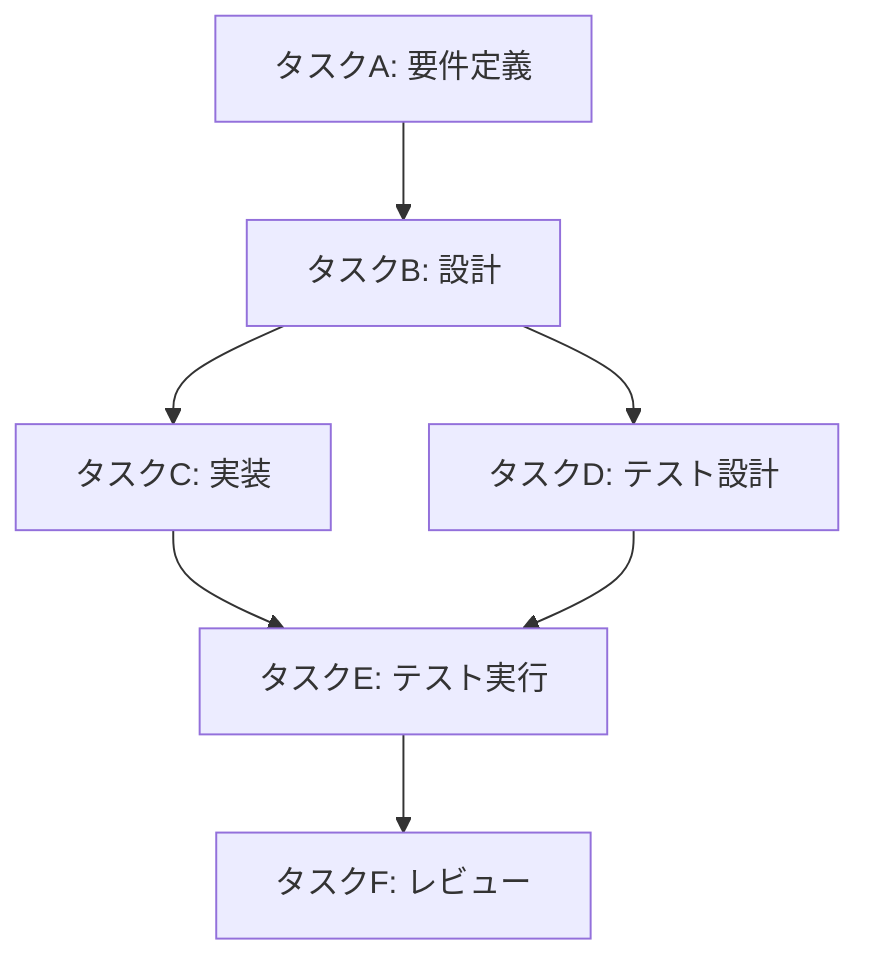
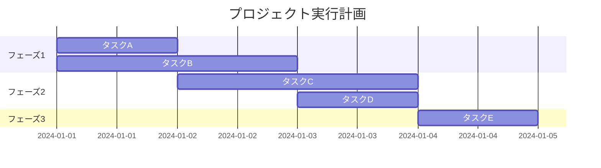

# 計画立案スキル（Planning Skill）

タスクの計画立案と管理を支援し、複雑な作業を効率的に実行可能な形に構造化します。

## 概要

このスキルは以下の機能を提供します：

1. **タスク分解**: 大きなタスクを管理可能な小タスクに分割
2. **依存関係分析**: タスク間の依存関係を特定
3. **実行順序決定**: 最適な実行順序の策定
4. **並列実行判定**: 並列実行可能なタスクの特定
5. **リソース配分**: 子エージェントへの作業割り当て計画

---

## 計画立案プロセス

### ステップ1: タスクの理解と分析

依頼されたタスクを深く理解する：

```
1. タスクの最終目標を明確化
2. 成功条件（完了基準）を定義
3. 制約事項・前提条件を特定
4. 必要なリソース・情報を列挙
```

**確認すべき質問：**
- このタスクのゴールは何か？
- 完了をどのように判断するか？
- 時間・技術的な制約はあるか？
- 必要な入力情報は揃っているか？

### ステップ2: タスクの分解

大きなタスクを実行可能な単位に分解する：

**分解の原則：**

| 原則 | 説明 |
|------|------|
| 単一責任 | 各タスクは1つの明確な目的を持つ |
| 独立性 | 可能な限り他タスクへの依存を減らす |
| 検証可能性 | 完了を客観的に確認できる |
| 適切な粒度 | 1-4時間程度で完了できるサイズ |

**分解テンプレート：**

```markdown
## タスク: [タスク名]

### 目的
[このタスクで達成すること]

### 入力
- [必要な入力1]
- [必要な入力2]

### 出力
- [期待される成果物1]
- [期待される成果物2]

### 完了条件
- [ ] [確認項目1]
- [ ] [確認項目2]
```

### ステップ3: 依存関係の分析

タスク間の依存関係を明確化する：

**依存関係の種類：**

| 種類 | 説明 | 例 |
|------|------|-----|
| FS (Finish-to-Start) | Aが完了後にBを開始 | 設計→実装 |
| SS (Start-to-Start) | Aの開始後にBを開始可能 | コーディング→テスト作成 |
| FF (Finish-to-Finish) | Aの完了後にBを完了可能 | 実装→ドキュメント |
| なし | 独立して実行可能 | 独立した機能開発 |

**依存関係図（Mermaid形式）：**



### ステップ4: 実行順序と並列化の決定

効率的な実行計画を策定する：

**並列実行の判定基準：**

```
並列実行可能な条件:
✓ 相互に依存関係がない
✓ 同じリソースを競合しない
✓ 共有状態を変更しない（または排他制御が可能）
```

**実行計画テンプレート：**

```markdown
## 実行計画

### フェーズ1（並列実行可能）
| タスク | 担当 | 推定時間 | 依存先 |
|--------|------|----------|--------|
| タスクA | エージェント1 | 30分 | なし |
| タスクB | エージェント2 | 45分 | なし |

### フェーズ2（フェーズ1完了後）
| タスク | 担当 | 推定時間 | 依存先 |
|--------|------|----------|--------|
| タスクC | エージェント1 | 60分 | タスクA |
| タスクD | エージェント2 | 40分 | タスクB |

### フェーズ3（フェーズ2完了後）
| タスク | 担当 | 推定時間 | 依存先 |
|--------|------|----------|--------|
| タスクE | エージェント1 | 30分 | タスクC, D |
```

### ステップ5: 子エージェントへの指示作成

子エージェントに委譲するための明確な指示を作成する：

**指示テンプレート：**

```markdown
## タスク: [タスク名]

### 作業情報
- 作業ディレクトリ: [絶対パス]
- ドキュメント出力先: [絶対パス]（または「なし」）
- タスク名: [識別子]

### 目的
[達成すべきこと]

### 具体的な作業内容
1. [作業ステップ1]
2. [作業ステップ2]
3. [作業ステップ3]

### 入力情報
- [提供する情報1]
- [提供する情報2]

### 期待される成果物
- [成果物1の説明]
- [成果物2の説明]

### 完了条件
- [ ] [確認項目1]
- [ ] [確認項目2]

### 注意事項
- [制約や特記事項]
```

---

## 計画の可視化

### ガントチャート形式（Mermaid）



### タスク一覧形式

```markdown
## タスク一覧

| ID | タスク名 | 状態 | 担当 | 依存 | 優先度 |
|----|----------|------|------|------|--------|
| T1 | 要件分析 | ✅完了 | 親 | - | 高 |
| T2 | 設計 | 🔄進行中 | 子1 | T1 | 高 |
| T3 | 実装A | ⏳待機 | 子2 | T2 | 中 |
| T4 | 実装B | ⏳待機 | 子3 | T2 | 中 |
| T5 | テスト | ⏳待機 | 子1 | T3,T4 | 高 |
```

---

## 優先順位付け

### 優先順位決定マトリクス

```
           緊急度高
              │
    ┌─────────┼─────────┐
    │ 重要＆緊急 │ 重要だが  │
    │ → 最優先  │ 緊急でない │
    │          │ → 計画的に │
重要度─┼─────────┼─────────┼─
    │ 重要でない │ 重要でも  │
    │ が緊急   │ 緊急でも  │
    │ → 委譲   │ ない→除外 │
    └─────────┼─────────┘
              │
           緊急度低
```

### 優先順位の判断基準

| 基準 | 高優先度 | 低優先度 |
|------|----------|----------|
| ビジネス影響 | 収益・顧客に直接影響 | 内部改善のみ |
| ブロッキング | 他タスクをブロック | 独立したタスク |
| リスク | 遅延時の影響が大きい | 遅延しても問題小 |
| 工数 | 少ない工数で大きな価値 | 工数対効果が低い |

---

## 進捗管理

### 進捗確認テンプレート

```markdown
## 進捗レポート

### 概要
- 計画開始: [日時]
- 現在時刻: [日時]
- 全体進捗: [X]%

### 完了タスク
- [x] タスクA - 完了（子エージェント1）
- [x] タスクB - 完了（子エージェント2）

### 進行中タスク
- [ ] タスクC - 70%完了（子エージェント1）

### 待機中タスク
- [ ] タスクD - タスクCの完了待ち

### 課題・リスク
- [課題がある場合は記載]

### 次のアクション
1. [次に行うこと]
```

---

## ベストプラクティス

### 計画立案時の注意点

1. **過度な詳細化を避ける**: 最初から完璧な計画は不要。イテレーティブに改善
2. **バッファを設ける**: 予期せぬ問題に備えて時間的余裕を確保
3. **明確な完了条件**: 曖昧な基準は避け、客観的に判断できる条件を設定
4. **定期的な見直し**: 計画は状況に応じて柔軟に調整

### 子エージェントへの委譲時の注意点

1. **文脈の十分な提供**: 必要な背景情報を漏れなく伝達
2. **自律性の尊重**: 方法の詳細は子エージェントに任せる
3. **成果物の明確化**: 何を期待しているかを具体的に指定
4. **フィードバックループ**: 必要に応じて中間確認を設定

---

## 使用例

### 例1: 機能追加タスクの計画

```
依頼: 「ユーザー認証機能を追加してください」

計画:
1. タスク分解
   - T1: 要件の明確化（親エージェント）
   - T2: データベーススキーマ設計（子1）
   - T3: 認証API実装（子2、T2に依存）
   - T4: フロントエンド実装（子3、T3に依存）
   - T5: テスト作成・実行（子1、T3/T4に依存）
   - T6: ドキュメント更新（子2、T5に依存）

2. 並列実行計画
   - フェーズ1: T1
   - フェーズ2: T2
   - フェーズ3: T3, T4（T3完了次第T4開始可能）
   - フェーズ4: T5
   - フェーズ5: T6
```

### 例2: バグ修正タスクの計画

```
依頼: 「ログイン時にエラーが発生する問題を修正してください」

計画:
1. タスク分解
   - T1: 問題の再現と原因調査（親エージェント）
   - T2: 修正実装（子1）
   - T3: 関連テスト修正・追加（子1、T2と並行可能）
   - T4: 回帰テスト実行（親エージェント、T2/T3完了後）

2. 並列実行計画
   - フェーズ1: T1
   - フェーズ2: T2, T3（並列実行）
   - フェーズ3: T4
```
