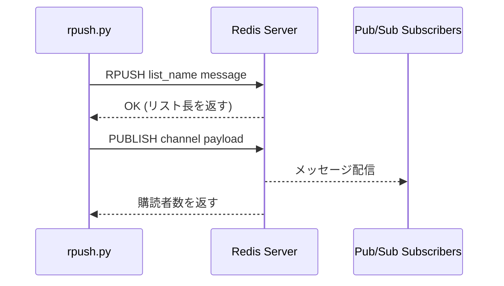

# redis-rpush-sender

Send messages to a Redis Blocked List using the bundled `rpush.py` script.

## Quick Start

Add a single message:
```bash
python scripts/rpush.py myqueue "Hello World"
```

Add multiple messages at once:
```bash
python scripts/rpush.py myqueue "msg1" "msg2" "msg3"
```

RPUSH and notify via Pub/Sub:
```bash
python scripts/rpush.py --channel notify:queue myqueue "Hello World"
```

## Script Usage

```bash
python scripts/rpush.py [OPTIONS] <list_name> <message> [<message2> ...]

Options:
  --host HOST        Redis host (default: redis)
  --port PORT        Redis port (default: 6379)
  --stdin            Read messages from stdin (one per line)
  --channel CHANNEL  Pub/Sub channel to publish messages to (in addition to RPUSH)
```

## Common Patterns

### Send to custom host
```bash
python scripts/rpush.py --host redis-dev --port 6379 tasks '{"action":"process"}'
```

### Pipe messages from file
```bash
cat messages.txt | python scripts/rpush.py --stdin jobqueue
```

### Send JSON payload
```bash
python scripts/rpush.py events '{"type":"user_created","id":123}'
```

### RPUSH with Pub/Sub notification
```bash
# Add to queue and notify subscribers on a channel
python scripts/rpush.py --channel summoner:abc123:monitor taskqueue '{"type":"task","task_id":"001"}'
```

When `--channel` is specified, the script performs two operations:
1. **RPUSH**: Adds the message to the specified Redis list
2. **PUBLISH**: Sends a notification to the specified Pub/Sub channel

The published message is a JSON object containing:
```json
{
  "queue": "taskqueue",
  "message": "{\"type\":\"task\",\"task_id\":\"001\"}",
  "timestamp": "2026-01-29T12:00:00+00:00"
}
```

This allows subscribers to know:
- Which queue received the message
- The original message content
- When the message was added

**Note**: If PUBLISH fails, RPUSH is still considered successful (a warning is displayed).

## `--channel` オプション詳細

`--channel` オプションは、メッセージをRedisリストに追加すると同時に、指定したPub/Subチャンネルへ通知を送信するためのものです。

### 基本的な使い方

```bash
python scripts/rpush.py --channel <channel_name> <list_name> <message>
```

### パラメータ

| パラメータ | 説明 | 例 |
|-----------|------|-----|
| `--channel` | Pub/Subチャンネル名 | `summoner:abc123:monitor` |
| `<list_name>` | RPUSHするRedisリスト名 | `summoner:abc123:tasks:1` |
| `<message>` | 送信するメッセージ（JSON推奨） | `'{"type":"task"}'` |

### 処理フロー



### Pub/Subメッセージフォーマット

`--channel` で送信されるPub/Subメッセージは、以下のJSON形式にラップされます：

```json
{
  "queue": "<list_name>",
  "message": "<original_message>",
  "timestamp": "<ISO 8601形式の日時>"
}
```

#### フィールド説明

| フィールド | 型 | 説明 |
|-----------|-----|------|
| `queue` | string | メッセージが追加されたRedisリスト名 |
| `message` | string | 元のメッセージ内容（文字列としてそのまま格納） |
| `timestamp` | string | メッセージ追加時刻（UTC、ISO 8601形式） |

#### 実例

入力:
```bash
python scripts/rpush.py --channel summoner:abc123:monitor summoner:abc123:tasks:1 '{"task_id":"task-001","action":"build"}'
```

Pub/Subで配信されるメッセージ:
```json
{
  "queue": "summoner:abc123:tasks:1",
  "message": "{\"task_id\":\"task-001\",\"action\":\"build\"}",
  "timestamp": "2026-01-29T12:34:56+00:00"
}
```

### モニタリング用途での使用

オーケストレーションのモニタリングでは、以下のパターンで使用します：

#### Summonerオーケストレーションでの使用例

```bash
# orchestration-initで生成されたセッション情報
SESSION_ID="a1b2c3d4-e5f6-7890-abcd-ef1234567890"
MONITOR_CHANNEL="summoner:${SESSION_ID}:monitor"

# moogleからchocobo-1へタスク送信（モニタリング付き）
python scripts/rpush.py \
  --channel "${MONITOR_CHANNEL}" \
  "summoner:${SESSION_ID}:tasks:1" \
  '{"type":"task","task_id":"task-001","action":"implement feature X"}'

# chocoboから報告送信（モニタリング付き）
python scripts/rpush.py \
  --channel "${MONITOR_CHANNEL}" \
  "summoner:${SESSION_ID}:reports" \
  '{"type":"report","task_id":"task-001","status":"completed"}'
```

#### 監視側（別ターミナル）

```bash
# redis-cliでPub/Subを購読
redis-cli SUBSCRIBE summoner:${SESSION_ID}:monitor

# または、channel_viewerツールを使用（開発中）
python scripts/channel_viewer/main.py
```

### 注意事項

1. **PUBLISH失敗時の挙動**: RPUSHが成功していれば、PUBLISHが失敗してもスクリプトは成功として終了します（警告メッセージを表示）
2. **購読者がいない場合**: 購読者が0人でもエラーにはなりません（出力に `(0 subscriber(s))` と表示）
3. **パフォーマンス**: 各メッセージに対して個別にPUBLISHするため、大量メッセージ送信時は若干のオーバーヘッドがあります

## Environment

- **Default host**: `redis` (Docker network service name)
- **Default port**: `6379`
- **Network**: Requires connection to `dev-network` where Redis runs
- No external dependencies (uses raw socket with RESP protocol)
